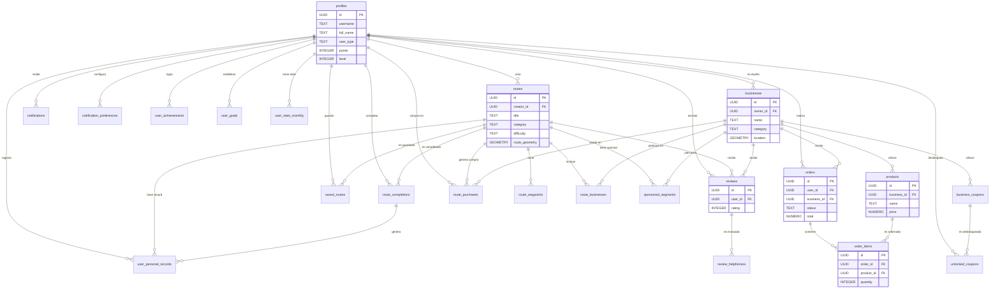

# Entregable Unidad 2 — Base de Datos Kaelo

## ¿Qué hace la app?

**Kaelo es una app móvil de turismo local que muestra rutas turísticas en mapa, negocios locales, productos, reseñas, cupones y gamificación (logros, metas, récords) para promover el turismo en Yucatán.**

---

## Diagrama Entidad-Relación (22 tablas)



---

## Lista completa de las 22 tablas

| # | Tabla | Descripción |
|---|-------|-------------|
| 1 | `profiles` | Perfiles de usuario (turista, negocio, admin) con gamificación (puntos, nivel, badges) |
| 2 | `routes` | Rutas turísticas con datos geoespaciales (LineString, puntos inicio/fin) |
| 3 | `route_waypoints` | Puntos de interés ordenados a lo largo de una ruta |
| 4 | `businesses` | Negocios locales (restaurantes, cafés, tiendas, etc.) con ubicación |
| 5 | `route_businesses` | Tabla intermedia ruta↔negocio con orden de visita |
| 6 | `products` | Productos y servicios que ofrecen los negocios |
| 7 | `orders` | Pedidos de clientes a negocios |
| 8 | `order_items` | Ítems individuales dentro de un pedido |
| 9 | `route_purchases` | Compras realizadas durante recorridos de rutas |
| 10 | `reviews` | Reseñas de usuarios para rutas y negocios (1-5 estrellas) |
| 11 | `review_helpfulness` | Votos de utilidad sobre reseñas |
| 12 | `saved_routes` | Rutas guardadas/favoritas por usuarios |
| 13 | `route_completions` | Seguimiento detallado del avance en rutas (GPS, métricas) |
| 14 | `notifications` | Notificaciones push para usuarios |
| 15 | `notification_preferences` | Preferencias de entrega de notificaciones |
| 16 | `business_coupons` | Cupones de descuento de negocios |
| 17 | `unlocked_coupons` | Cupones desbloqueados y canjeados por usuarios |
| 18 | `sponsored_segments` | Segmentos patrocinados en rutas (publicidad) |
| 19 | `user_achievements` | Sistema de logros/gamificación (20 tipos de achievement) |
| 20 | `user_goals` | Metas personales del usuario (distancia, velocidad, etc.) |
| 21 | `user_personal_records` | Récords personales por ruta (mejor tiempo, velocidad) |
| 22 | `user_stats_monthly` | Estadísticas mensuales pre-agregadas por usuario |

---

## Código SQL — CREATE TABLE de todas las tablas

### 1. `profiles`
```sql
CREATE TABLE IF NOT EXISTS public.profiles (
    id UUID PRIMARY KEY REFERENCES auth.users(id) ON DELETE CASCADE,
    username TEXT UNIQUE,
    full_name TEXT,
    avatar_url TEXT,
    bio TEXT,
    phone TEXT,
    user_type TEXT NOT NULL DEFAULT 'tourist'
        CHECK (user_type IN ('tourist', 'local_business', 'admin')),
    is_active BOOLEAN NOT NULL DEFAULT true,
    points INTEGER NOT NULL DEFAULT 0 CHECK (points >= 0),
    level INTEGER NOT NULL DEFAULT 1 CHECK (level >= 1),
    badges JSONB DEFAULT '[]'::jsonb,
    privacy_settings JSONB DEFAULT '{"show_profile": true, "show_routes": true, "show_reviews": true}'::jsonb,
    preferences JSONB DEFAULT '{"language": "es", "notifications_enabled": true, "theme": "light"}'::jsonb,
    created_at TIMESTAMPTZ NOT NULL DEFAULT NOW(),
    updated_at TIMESTAMPTZ NOT NULL DEFAULT NOW(),
    last_active_at TIMESTAMPTZ
);
```

### 2. `routes`
```sql
CREATE TABLE IF NOT EXISTS public.routes (
    id UUID PRIMARY KEY DEFAULT uuid_generate_v4(),
    creator_id UUID NOT NULL REFERENCES public.profiles(id) ON DELETE CASCADE,
    title TEXT NOT NULL,
    description TEXT,
    category TEXT NOT NULL CHECK (category IN ('gastronomica','cultural','artesanal','naturaleza','aventura','historica','familiar','nocturna')),
    difficulty TEXT NOT NULL DEFAULT 'facil' CHECK (difficulty IN ('facil','moderado','dificil')),
    estimated_duration INTEGER NOT NULL CHECK (estimated_duration > 0),
    distance NUMERIC(10,2) CHECK (distance >= 0),
    route_geometry GEOMETRY(LINESTRING, 4326) NOT NULL,
    start_location GEOMETRY(POINT, 4326) NOT NULL,
    end_location GEOMETRY(POINT, 4326) NOT NULL,
    images JSONB DEFAULT '[]'::jsonb,
    cover_image TEXT,
    rating NUMERIC(3,2) DEFAULT 0,
    total_reviews INTEGER NOT NULL DEFAULT 0,
    total_completions INTEGER NOT NULL DEFAULT 0,
    total_saves INTEGER NOT NULL DEFAULT 0,
    is_published BOOLEAN NOT NULL DEFAULT false,
    is_featured BOOLEAN NOT NULL DEFAULT false,
    is_verified BOOLEAN NOT NULL DEFAULT false,
    tags TEXT[] DEFAULT '{}',
    recommended_for TEXT[] DEFAULT '{}',
    best_time_to_visit TEXT,
    accessibility_info TEXT,
    created_at TIMESTAMPTZ NOT NULL DEFAULT NOW(),
    updated_at TIMESTAMPTZ NOT NULL DEFAULT NOW(),
    published_at TIMESTAMPTZ
);
```

### 3. `route_waypoints`
```sql
CREATE TABLE IF NOT EXISTS public.route_waypoints (
    id UUID PRIMARY KEY DEFAULT uuid_generate_v4(),
    route_id UUID NOT NULL REFERENCES public.routes(id) ON DELETE CASCADE,
    title TEXT NOT NULL,
    description TEXT,
    order_index INTEGER NOT NULL CHECK (order_index >= 0),
    location GEOMETRY(POINT, 4326) NOT NULL,
    address TEXT,
    waypoint_type TEXT NOT NULL DEFAULT 'point_of_interest'
        CHECK (waypoint_type IN ('start','end','point_of_interest','rest_stop','photo_spot','warning','information')),
    images JSONB DEFAULT '[]'::jsonb,
    estimated_time_from_previous INTEGER,
    distance_from_previous NUMERIC(10,2),
    tips TEXT,
    accessibility_info TEXT,
    created_at TIMESTAMPTZ NOT NULL DEFAULT NOW(),
    updated_at TIMESTAMPTZ NOT NULL DEFAULT NOW()
);
```

### 4. `businesses`
```sql
CREATE TABLE IF NOT EXISTS public.businesses (
    id UUID PRIMARY KEY DEFAULT uuid_generate_v4(),
    owner_id UUID REFERENCES public.profiles(id) ON DELETE SET NULL,
    name TEXT NOT NULL,
    description TEXT,
    category TEXT NOT NULL CHECK (category IN ('restaurante','cafe','bar','tienda','artesania','museo','galeria','hotel','hostal','tour','transporte','otro')),
    subcategory TEXT,
    location GEOMETRY(POINT, 4326) NOT NULL,
    address TEXT NOT NULL,
    city TEXT NOT NULL,
    state TEXT,
    postal_code TEXT,
    country TEXT NOT NULL DEFAULT 'Mexico',
    phone TEXT, email TEXT, website TEXT,
    social_media JSONB DEFAULT '{}'::jsonb,
    images JSONB DEFAULT '[]'::jsonb,
    logo_url TEXT, cover_image TEXT,
    opening_hours JSONB,
    price_range TEXT CHECK (price_range IN ('$','$$','$$$','$$$$')),
    amenities TEXT[] DEFAULT '{}',
    payment_methods TEXT[] DEFAULT '{}',
    rating NUMERIC(3,2) DEFAULT 0,
    total_reviews INTEGER NOT NULL DEFAULT 0,
    total_visits INTEGER NOT NULL DEFAULT 0,
    is_active BOOLEAN NOT NULL DEFAULT true,
    is_verified BOOLEAN NOT NULL DEFAULT false,
    is_sponsored BOOLEAN NOT NULL DEFAULT false,
    tags TEXT[] DEFAULT '{}',
    created_at TIMESTAMPTZ NOT NULL DEFAULT NOW(),
    updated_at TIMESTAMPTZ NOT NULL DEFAULT NOW()
);
```

### 5. `route_businesses`
```sql
CREATE TABLE IF NOT EXISTS public.route_businesses (
    id UUID PRIMARY KEY DEFAULT uuid_generate_v4(),
    route_id UUID NOT NULL REFERENCES public.routes(id) ON DELETE CASCADE,
    business_id UUID NOT NULL REFERENCES public.businesses(id) ON DELETE CASCADE,
    order_index INTEGER NOT NULL CHECK (order_index >= 0),
    is_required BOOLEAN NOT NULL DEFAULT false,
    estimated_visit_duration INTEGER CHECK (estimated_visit_duration > 0),
    recommended_time TEXT,
    special_notes TEXT,
    distance_from_previous NUMERIC(10,2),
    highlights TEXT[] DEFAULT '{}',
    created_at TIMESTAMPTZ NOT NULL DEFAULT NOW(),
    updated_at TIMESTAMPTZ NOT NULL DEFAULT NOW()
);
```

### 6. `products`
```sql
CREATE TABLE IF NOT EXISTS public.products (
    id UUID PRIMARY KEY DEFAULT uuid_generate_v4(),
    business_id UUID NOT NULL REFERENCES public.businesses(id) ON DELETE CASCADE,
    name TEXT NOT NULL,
    description TEXT,
    category TEXT NOT NULL,
    price NUMERIC(10,2) NOT NULL CHECK (price >= 0),
    currency TEXT NOT NULL DEFAULT 'MXN',
    discount_percentage INTEGER,
    discounted_price NUMERIC(10,2),
    images JSONB DEFAULT '[]'::jsonb,
    primary_image TEXT,
    stock_quantity INTEGER,
    is_available BOOLEAN NOT NULL DEFAULT true,
    variants JSONB DEFAULT '[]'::jsonb,
    specifications JSONB DEFAULT '{}'::jsonb,
    rating NUMERIC(3,2) DEFAULT 0,
    total_reviews INTEGER NOT NULL DEFAULT 0,
    total_sales INTEGER NOT NULL DEFAULT 0,
    tags TEXT[] DEFAULT '{}',
    is_featured BOOLEAN NOT NULL DEFAULT false,
    is_active BOOLEAN NOT NULL DEFAULT true,
    created_at TIMESTAMPTZ NOT NULL DEFAULT NOW(),
    updated_at TIMESTAMPTZ NOT NULL DEFAULT NOW()
);
```

### 7. `orders`
```sql
CREATE TABLE IF NOT EXISTS public.orders (
    id UUID PRIMARY KEY DEFAULT uuid_generate_v4(),
    user_id UUID NOT NULL REFERENCES public.profiles(id) ON DELETE CASCADE,
    business_id UUID NOT NULL REFERENCES public.businesses(id) ON DELETE RESTRICT,
    order_number TEXT NOT NULL UNIQUE,
    status TEXT NOT NULL DEFAULT 'pending'
        CHECK (status IN ('pending','confirmed','preparing','ready','completed','cancelled','refunded')),
    subtotal NUMERIC(10,2) NOT NULL,
    tax NUMERIC(10,2) NOT NULL DEFAULT 0,
    discount NUMERIC(10,2) NOT NULL DEFAULT 0,
    total NUMERIC(10,2) NOT NULL,
    currency TEXT NOT NULL DEFAULT 'MXN',
    payment_method TEXT CHECK (payment_method IN ('cash','card','transfer','digital_wallet')),
    payment_status TEXT NOT NULL DEFAULT 'pending'
        CHECK (payment_status IN ('pending','paid','failed','refunded')),
    delivery_method TEXT NOT NULL DEFAULT 'pickup'
        CHECK (delivery_method IN ('pickup','delivery','dine_in')),
    delivery_address TEXT,
    special_instructions TEXT,
    created_at TIMESTAMPTZ NOT NULL DEFAULT NOW(),
    updated_at TIMESTAMPTZ NOT NULL DEFAULT NOW()
);
```

### 8. `order_items`
```sql
CREATE TABLE IF NOT EXISTS public.order_items (
    id UUID PRIMARY KEY DEFAULT uuid_generate_v4(),
    order_id UUID NOT NULL REFERENCES public.orders(id) ON DELETE CASCADE,
    product_id UUID NOT NULL REFERENCES public.products(id) ON DELETE RESTRICT,
    quantity INTEGER NOT NULL CHECK (quantity > 0),
    unit_price NUMERIC(10,2) NOT NULL CHECK (unit_price >= 0),
    subtotal NUMERIC(10,2) NOT NULL CHECK (subtotal >= 0),
    variant_selection JSONB,
    special_instructions TEXT,
    created_at TIMESTAMPTZ NOT NULL DEFAULT NOW()
);
```

### 9. `route_purchases`
```sql
CREATE TABLE IF NOT EXISTS public.route_purchases (
    id UUID PRIMARY KEY DEFAULT uuid_generate_v4(),
    route_id UUID NOT NULL REFERENCES public.routes(id) ON DELETE CASCADE,
    user_id UUID NOT NULL REFERENCES public.profiles(id) ON DELETE CASCADE,
    business_id UUID NOT NULL REFERENCES public.businesses(id) ON DELETE CASCADE,
    order_id UUID REFERENCES public.orders(id) ON DELETE SET NULL,
    amount NUMERIC(10,2) NOT NULL CHECK (amount >= 0),
    currency TEXT NOT NULL DEFAULT 'MXN',
    is_verified BOOLEAN NOT NULL DEFAULT false,
    verification_method TEXT,
    receipt_image TEXT,
    purchase_location GEOMETRY(POINT, 4326),
    distance_from_business NUMERIC(10,2),
    points_earned INTEGER NOT NULL DEFAULT 0,
    purchased_at TIMESTAMPTZ NOT NULL DEFAULT NOW(),
    created_at TIMESTAMPTZ NOT NULL DEFAULT NOW()
);
```

### 10. `reviews`
```sql
CREATE TABLE IF NOT EXISTS public.reviews (
    id UUID PRIMARY KEY DEFAULT uuid_generate_v4(),
    user_id UUID NOT NULL REFERENCES public.profiles(id) ON DELETE CASCADE,
    route_id UUID REFERENCES public.routes(id) ON DELETE CASCADE,
    business_id UUID REFERENCES public.businesses(id) ON DELETE CASCADE,
    rating INTEGER NOT NULL CHECK (rating >= 1 AND rating <= 5),
    title TEXT,
    comment TEXT,
    detailed_ratings JSONB DEFAULT '{}'::jsonb,
    images JSONB DEFAULT '[]'::jsonb,
    is_verified_visit BOOLEAN NOT NULL DEFAULT false,
    visit_date DATE,
    helpful_count INTEGER NOT NULL DEFAULT 0,
    not_helpful_count INTEGER NOT NULL DEFAULT 0,
    is_visible BOOLEAN NOT NULL DEFAULT true,
    is_flagged BOOLEAN NOT NULL DEFAULT false,
    owner_response TEXT,
    owner_response_at TIMESTAMPTZ,
    created_at TIMESTAMPTZ NOT NULL DEFAULT NOW(),
    updated_at TIMESTAMPTZ NOT NULL DEFAULT NOW()
);
```

### 11. `review_helpfulness`
```sql
CREATE TABLE IF NOT EXISTS public.review_helpfulness (
    id UUID PRIMARY KEY DEFAULT uuid_generate_v4(),
    review_id UUID NOT NULL REFERENCES public.reviews(id) ON DELETE CASCADE,
    user_id UUID NOT NULL REFERENCES public.profiles(id) ON DELETE CASCADE,
    is_helpful BOOLEAN NOT NULL,
    created_at TIMESTAMPTZ NOT NULL DEFAULT NOW(),
    CONSTRAINT unique_user_review_helpfulness UNIQUE (user_id, review_id)
);
```

### 12. `saved_routes`
```sql
CREATE TABLE IF NOT EXISTS public.saved_routes (
    id UUID PRIMARY KEY DEFAULT uuid_generate_v4(),
    user_id UUID NOT NULL REFERENCES public.profiles(id) ON DELETE CASCADE,
    route_id UUID NOT NULL REFERENCES public.routes(id) ON DELETE CASCADE,
    collection_name TEXT,
    notes TEXT,
    is_completed BOOLEAN NOT NULL DEFAULT false,
    saved_at TIMESTAMPTZ NOT NULL DEFAULT NOW(),
    completed_at TIMESTAMPTZ,
    CONSTRAINT unique_user_saved_route UNIQUE (user_id, route_id)
);
```

### 13. `route_completions`
```sql
CREATE TABLE IF NOT EXISTS public.route_completions (
    id UUID PRIMARY KEY DEFAULT uuid_generate_v4(),
    user_id UUID NOT NULL REFERENCES public.profiles(id) ON DELETE CASCADE,
    route_id UUID NOT NULL REFERENCES public.routes(id) ON DELETE CASCADE,
    status TEXT NOT NULL DEFAULT 'in_progress'
        CHECK (status IN ('in_progress','completed','abandoned')),
    completion_percentage INTEGER NOT NULL DEFAULT 0,
    waypoints_visited JSONB DEFAULT '[]'::jsonb,
    businesses_visited JSONB DEFAULT '[]'::jsonb,
    actual_path GEOMETRY(LINESTRING, 4326),
    total_distance_traveled NUMERIC(10,2),
    started_at TIMESTAMPTZ NOT NULL DEFAULT NOW(),
    completed_at TIMESTAMPTZ,
    total_duration INTEGER,
    points_earned INTEGER NOT NULL DEFAULT 0,
    badges_earned JSONB DEFAULT '[]'::jsonb,
    total_spent NUMERIC(10,2) DEFAULT 0,
    rating INTEGER CHECK (rating >= 1 AND rating <= 5),
    feedback TEXT,
    -- Columnas adicionales del sistema de métricas:
    distance_actual_km NUMERIC(6,2),
    avg_speed_kmh NUMERIC(4,1),
    max_speed_kmh NUMERIC(4,1),
    calories_burned INTEGER,
    elevation_gain_actual_m INTEGER,
    weather_conditions JSONB DEFAULT '{}'::jsonb,
    device_info JSONB DEFAULT '{}'::jsonb,
    created_at TIMESTAMPTZ NOT NULL DEFAULT NOW(),
    updated_at TIMESTAMPTZ NOT NULL DEFAULT NOW()
);
```

### 14. `notifications`
```sql
CREATE TABLE IF NOT EXISTS public.notifications (
    id UUID PRIMARY KEY DEFAULT uuid_generate_v4(),
    user_id UUID NOT NULL REFERENCES public.profiles(id) ON DELETE CASCADE,
    type TEXT NOT NULL CHECK (type IN (
        'route_published','route_featured','new_follower','new_review',
        'review_response','order_status','coupon_unlocked','badge_earned',
        'level_up','route_completion','business_promotion','system_announcement'
    )),
    title TEXT NOT NULL,
    message TEXT NOT NULL,
    related_route_id UUID REFERENCES public.routes(id),
    related_business_id UUID REFERENCES public.businesses(id),
    related_order_id UUID REFERENCES public.orders(id),
    related_user_id UUID REFERENCES public.profiles(id),
    metadata JSONB DEFAULT '{}'::jsonb,
    action_url TEXT,
    is_read BOOLEAN NOT NULL DEFAULT false,
    priority TEXT NOT NULL DEFAULT 'normal'
        CHECK (priority IN ('low','normal','high','urgent')),
    created_at TIMESTAMPTZ NOT NULL DEFAULT NOW()
);
```

### 15. `notification_preferences`
```sql
CREATE TABLE IF NOT EXISTS public.notification_preferences (
    id UUID PRIMARY KEY DEFAULT uuid_generate_v4(),
    user_id UUID NOT NULL REFERENCES public.profiles(id) ON DELETE CASCADE,
    route_published BOOLEAN NOT NULL DEFAULT true,
    new_review BOOLEAN NOT NULL DEFAULT true,
    order_status BOOLEAN NOT NULL DEFAULT true,
    badge_earned BOOLEAN NOT NULL DEFAULT true,
    push_enabled BOOLEAN NOT NULL DEFAULT true,
    email_enabled BOOLEAN NOT NULL DEFAULT true,
    quiet_hours_enabled BOOLEAN NOT NULL DEFAULT false,
    quiet_hours_start TIME,
    quiet_hours_end TIME,
    created_at TIMESTAMPTZ NOT NULL DEFAULT NOW(),
    updated_at TIMESTAMPTZ NOT NULL DEFAULT NOW(),
    CONSTRAINT unique_user_preferences UNIQUE (user_id)
);
```

### 16. `business_coupons`
```sql
CREATE TABLE IF NOT EXISTS public.business_coupons (
    id UUID PRIMARY KEY DEFAULT uuid_generate_v4(),
    business_id UUID NOT NULL REFERENCES public.businesses(id) ON DELETE CASCADE,
    code TEXT NOT NULL,
    title TEXT NOT NULL,
    description TEXT,
    discount_type TEXT NOT NULL CHECK (discount_type IN ('percentage','fixed_amount','free_item')),
    discount_value NUMERIC(10,2) NOT NULL CHECK (discount_value > 0),
    max_discount_amount NUMERIC(10,2),
    min_purchase_amount NUMERIC(10,2),
    max_uses_total INTEGER,
    max_uses_per_user INTEGER,
    current_uses INTEGER NOT NULL DEFAULT 0,
    requires_route_completion BOOLEAN NOT NULL DEFAULT false,
    required_route_id UUID REFERENCES public.routes(id),
    valid_from TIMESTAMPTZ NOT NULL DEFAULT NOW(),
    valid_until TIMESTAMPTZ NOT NULL,
    is_active BOOLEAN NOT NULL DEFAULT true,
    created_at TIMESTAMPTZ NOT NULL DEFAULT NOW(),
    updated_at TIMESTAMPTZ NOT NULL DEFAULT NOW()
);
```

### 17. `unlocked_coupons`
```sql
CREATE TABLE IF NOT EXISTS public.unlocked_coupons (
    id UUID PRIMARY KEY DEFAULT uuid_generate_v4(),
    user_id UUID NOT NULL REFERENCES public.profiles(id) ON DELETE CASCADE,
    coupon_id UUID NOT NULL REFERENCES public.business_coupons(id) ON DELETE CASCADE,
    is_used BOOLEAN NOT NULL DEFAULT false,
    used_count INTEGER NOT NULL DEFAULT 0,
    used_in_order_id UUID REFERENCES public.orders(id),
    unlocked_at TIMESTAMPTZ NOT NULL DEFAULT NOW(),
    used_at TIMESTAMPTZ,
    expires_at TIMESTAMPTZ,
    CONSTRAINT unique_user_coupon UNIQUE (user_id, coupon_id)
);
```

### 18. `sponsored_segments`
```sql
CREATE TABLE IF NOT EXISTS public.sponsored_segments (
    id UUID PRIMARY KEY DEFAULT uuid_generate_v4(),
    business_id UUID NOT NULL REFERENCES public.businesses(id) ON DELETE CASCADE,
    route_id UUID NOT NULL REFERENCES public.routes(id) ON DELETE CASCADE,
    segment_type TEXT NOT NULL CHECK (segment_type IN ('start','middle','end','detour')),
    priority INTEGER NOT NULL DEFAULT 0,
    segment_geometry GEOMETRY(LINESTRING, 4326),
    title TEXT NOT NULL,
    description TEXT,
    call_to_action TEXT,
    banner_image TEXT,
    impressions INTEGER NOT NULL DEFAULT 0,
    clicks INTEGER NOT NULL DEFAULT 0,
    conversions INTEGER NOT NULL DEFAULT 0,
    active_from TIMESTAMPTZ NOT NULL DEFAULT NOW(),
    active_until TIMESTAMPTZ NOT NULL,
    is_active BOOLEAN NOT NULL DEFAULT true,
    created_at TIMESTAMPTZ NOT NULL DEFAULT NOW(),
    updated_at TIMESTAMPTZ NOT NULL DEFAULT NOW()
);
```

### 19. `user_achievements`
```sql
CREATE TABLE IF NOT EXISTS public.user_achievements (
    id UUID PRIMARY KEY DEFAULT uuid_generate_v4(),
    user_id UUID NOT NULL REFERENCES public.profiles(id) ON DELETE CASCADE,
    achievement_type TEXT NOT NULL CHECK (achievement_type IN (
        'first_ride','speed_demon','distance_10km','distance_50km',
        'distance_100km_total','distance_500km_total','distance_1000km_total',
        'routes_completed_10','routes_completed_50','streak_7_days','streak_30_days',
        'early_bird','night_rider','explorer','supporter','socialite',
        'cenote_hunter','elevation_master','all_weather','route_creator'
    )),
    metadata JSONB DEFAULT '{}'::jsonb,
    progress_current INTEGER DEFAULT 0,
    progress_target INTEGER NOT NULL CHECK (progress_target > 0),
    is_unlocked BOOLEAN DEFAULT FALSE,
    points_awarded INTEGER DEFAULT 0,
    badge_icon TEXT,
    unlocked_at TIMESTAMPTZ,
    created_at TIMESTAMPTZ NOT NULL DEFAULT NOW(),
    updated_at TIMESTAMPTZ NOT NULL DEFAULT NOW(),
    UNIQUE(user_id, achievement_type)
);
```

### 20. `user_goals`
```sql
CREATE TABLE IF NOT EXISTS public.user_goals (
    id UUID PRIMARY KEY DEFAULT uuid_generate_v4(),
    user_id UUID NOT NULL REFERENCES public.profiles(id) ON DELETE CASCADE,
    goal_type TEXT NOT NULL CHECK (goal_type IN (
        'distance_monthly','distance_weekly','routes_count','streak_days',
        'avg_speed','elevation_total','calories','custom'
    )),
    title TEXT NOT NULL,
    description TEXT,
    target_value NUMERIC(10,2) NOT NULL CHECK (target_value > 0),
    current_value NUMERIC(10,2) DEFAULT 0,
    unit TEXT NOT NULL DEFAULT 'km',
    status TEXT NOT NULL DEFAULT 'active'
        CHECK (status IN ('active','completed','abandoned','expired')),
    deadline TIMESTAMPTZ,
    started_at TIMESTAMPTZ NOT NULL DEFAULT NOW(),
    completed_at TIMESTAMPTZ,
    reward_points INTEGER DEFAULT 0,
    created_at TIMESTAMPTZ NOT NULL DEFAULT NOW(),
    updated_at TIMESTAMPTZ NOT NULL DEFAULT NOW()
);
```

### 21. `user_personal_records`
```sql
CREATE TABLE IF NOT EXISTS public.user_personal_records (
    id UUID PRIMARY KEY DEFAULT uuid_generate_v4(),
    user_id UUID NOT NULL REFERENCES public.profiles(id) ON DELETE CASCADE,
    route_id UUID NOT NULL REFERENCES public.routes(id) ON DELETE CASCADE,
    completion_id UUID NOT NULL REFERENCES public.route_completions(id) ON DELETE CASCADE,
    record_type TEXT NOT NULL CHECK (record_type IN (
        'fastest_time','highest_avg_speed','lowest_time','most_distance'
    )),
    best_time_min INTEGER,
    best_avg_speed_kmh NUMERIC(4,1),
    best_distance_km NUMERIC(6,2),
    previous_record_id UUID REFERENCES public.user_personal_records(id),
    improvement_percentage NUMERIC(5,2),
    achieved_at TIMESTAMPTZ NOT NULL,
    created_at TIMESTAMPTZ NOT NULL DEFAULT NOW(),
    UNIQUE(user_id, route_id, record_type)
);
```

### 22. `user_stats_monthly`
```sql
CREATE TABLE IF NOT EXISTS public.user_stats_monthly (
    id UUID PRIMARY KEY DEFAULT uuid_generate_v4(),
    user_id UUID NOT NULL REFERENCES public.profiles(id) ON DELETE CASCADE,
    year INTEGER NOT NULL,
    month INTEGER NOT NULL CHECK (month >= 1 AND month <= 12),
    total_distance_km NUMERIC(10,2) DEFAULT 0,
    total_rides INTEGER DEFAULT 0,
    total_duration_min INTEGER DEFAULT 0,
    total_elevation_gain_m INTEGER DEFAULT 0,
    avg_speed_kmh NUMERIC(4,1),
    max_speed_kmh NUMERIC(4,1),
    total_calories_burned INTEGER DEFAULT 0,
    routes_completed INTEGER DEFAULT 0,
    unique_routes_completed INTEGER DEFAULT 0,
    achievements_unlocked INTEGER DEFAULT 0,
    total_points_earned INTEGER DEFAULT 0,
    calculated_at TIMESTAMPTZ NOT NULL DEFAULT NOW(),
    created_at TIMESTAMPTZ NOT NULL DEFAULT NOW(),
    updated_at TIMESTAMPTZ NOT NULL DEFAULT NOW(),
    UNIQUE(user_id, year, month)
);
```

---

## Código que conecta a la BD (TypeScript / React Native + Supabase)

### Conexión principal — `src/lib/supabase.ts`
```typescript
import ENV from "@/config/env";
import AsyncStorage from "@react-native-async-storage/async-storage";
import { createClient } from "@supabase/supabase-js";
import "react-native-url-polyfill/auto";
import { Database } from "../../database.types";

// Crear cliente Supabase con AsyncStorage para persistencia de sesión
export const supabase = createClient<Database>(
  ENV.SUPABASE_URL,       // "https://xxfpttxkqzjuuoejxznt.supabase.co"
  ENV.SUPABASE_ANON_KEY,
  {
    auth: {
      storage: AsyncStorage,
      autoRefreshToken: true,
      persistSession: true,
      detectSessionInUrl: false,
    },
  },
);
```

### Consultas a rutas — `src/features/routes/api.ts`
```typescript
import { supabase } from "@/lib/supabase";

// SELECT — obtener rutas publicadas con filtros
export const fetchPublishedRoutes = async (filters?: RouteFilters) => {
  const { data, error } = await supabase.rpc("get_published_routes", {
    p_difficulty: filters?.difficulty ?? null,
    p_terrain: filters?.terrain ?? null,
    p_max_distance: filters?.maxDistance ?? null,
    p_min_distance: filters?.minDistance ?? null,
  });
  if (error) throw new Error(error.message);
  return data ?? [];
};

// SELECT — obtener detalle de una ruta (ruta + waypoints + negocios)
export const fetchRouteDetail = async (routeId: string) => {
  const { data, error } = await supabase.rpc("get_route_detail", {
    p_route_id: routeId,
  });
  if (error) throw new Error(error.message);
  return data;
};

// SELECT — buscar rutas por nombre/descripción/municipio
export const searchRoutes = async (query: string) => {
  const { data, error } = await supabase.rpc("search_routes", {
    p_query: query.trim(),
  });
  if (error) throw new Error(error.message);
  return data ?? [];
};
```

### Consultas a negocios — `src/features/businesses/api.ts`
```typescript
import { supabase } from "@/lib/supabase";

// SELECT — obtener negocios activos con filtro de tipo
export const fetchBusinesses = async (type?: BusinessType | null) => {
  const { data, error } = await supabase.rpc("get_active_businesses", {
    p_type: type ?? null,
  });
  if (error) throw new Error(error.message);
  return data ?? [];
};

// SELECT — detalle de negocio con sus productos
export const fetchBusinessDetail = async (businessId: string) => {
  const { data, error } = await supabase.rpc("get_business_detail", {
    p_business_id: businessId,
  });
  if (error) throw new Error(error.message);
  return data;
};
```

### Autenticación — `src/shared/store/authStore.ts`
```typescript
import { supabase } from "@/lib/supabase";

// INSERT — registro de usuario (crea perfil automáticamente via trigger)
const { error } = await supabase.auth.signUp({
  email, password,
  options: { data: { username, full_name } }
});

// SELECT — login
const { error } = await supabase.auth.signInWithPassword({ email, password });

// DELETE sesión — logout
const { error } = await supabase.auth.signOut();
```

---

## Tecnologías usadas

| Componente | Tecnología |
|---|---|
| **Base de datos** | PostgreSQL (Supabase) |
| **Extensiones BD** | PostGIS (datos geoespaciales), uuid-ossp |
| **Backend/API** | Supabase (BaaS) — funciones RPC en SQL |
| **Frontend** | React Native (Expo) + TypeScript |
| **Autenticación** | Supabase Auth |
| **Mapas** | Mapbox |
| **ORM/Client** | @supabase/supabase-js con tipos generados |
